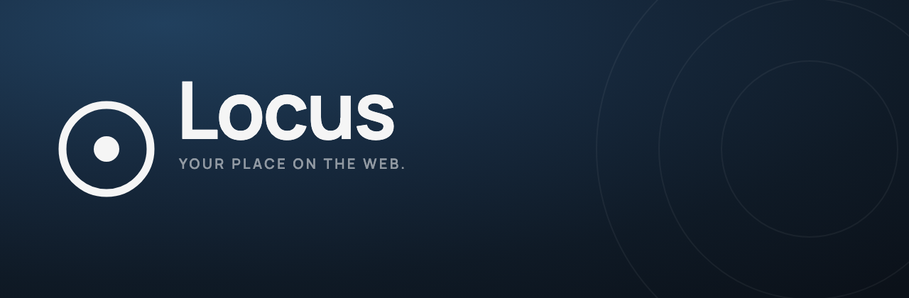
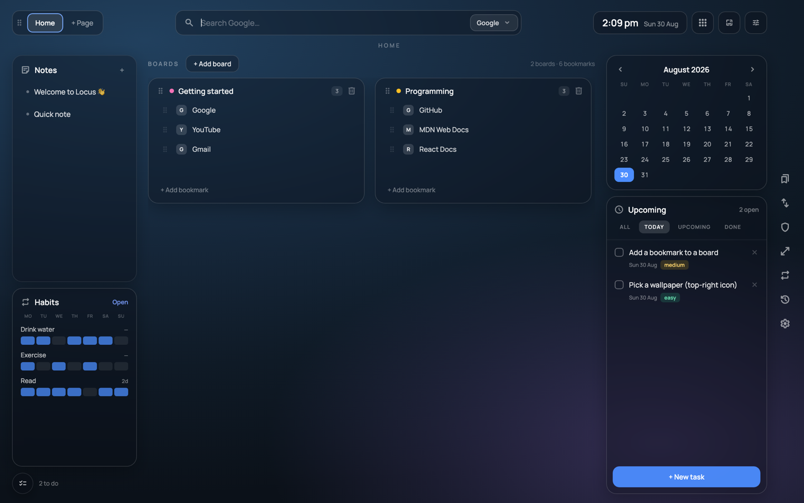

<p align="center">
  
</p>

<p align="center">
  
  
  
</p>

**Locus** comes from the Latin word for *place* — a point, position, or space
where something belongs.

Our attention is scattered across dozens of tabs, apps, bookmarks, notes and
reminders. Locus creates one intentional place for the things that matter. Every
time you open a new tab it brings your digital world together — your links,
bookmarks, tasks, habits, calendar, notes and reflections — so you can see where
you are, remember what matters, and decide what comes next.

*Less scattered. More intentional.*

<p align="center">
  
</p>

---

## What Locus does

Locus replaces the browser's new-tab page with a personal dashboard for everyday
life.

- 🔖 **Organise your bookmarks** and important links into meaningful spaces
- ✅ **Plan your tasks** and see what needs your attention
- 🌱 **Build and track** everyday habits
- 📅 **See your calendar** and upcoming plans
- 📝 **Capture quick thoughts** and notes
- 📖 **Reflect on your days** through date-based journaling
- 🎨 **Personalise your space** with your own background and aesthetic

**100% local.** No account, no server, no tracking. Everything is stored in
`chrome.storage.local` on your machine and never leaves the browser. Bookmarks
are read from and written to Chrome's own bookmark store.

Built with Vite + React + TypeScript. Manifest V3.

---

## Install (unpacked)

Not on the Chrome Web Store yet — load it manually. Works in Chrome, Edge,
Brave, and any other Chromium browser.

1. **Download the code:**
   - **Clone** (recommended) — you get a `Locus/` folder:
     ```bash
     git clone https://github.com/atkareprathmesh/Locus.git
     ```
   - or **Code → Download ZIP** and unzip — GitHub names the folder
     `Locus-main` (repo name + branch). That's normal; just `cd` into whatever
     name you see.
2. **Build it** (use the folder name from step 1 — `Locus` or `Locus-main`):
   ```bash
   cd Locus        # or: cd Locus-main
   npm install
   npm run build
   ```
   This creates a `dist/` folder.
3. Open `chrome://extensions` (Edge: `edge://extensions`, Brave:
   `brave://extensions`).
4. Turn on **Developer mode** (top-right toggle).
5. Click **Load unpacked** and select the `dist` folder inside your project
   folder (`Locus/dist` or `Locus-main/dist`).
6. **Keep the `dist` folder where it is** — don't move or delete it. Chrome loads
   the extension from that path every time.
7. Open a new tab. If Chrome asks *"An extension changed your New Tab page"* →
   **Keep it**.

### Browsers that keep their own new tab (Comet, Arc, …)

Some Chromium browsers — notably Perplexity **Comet** and **Arc** — don't let an
unpacked extension replace the new-tab page, so opening a tab still shows their
page. Locus still works there: **click the Locus toolbar icon** to open the
dashboard in a tab. Pin the icon so it's always one click away.

To update later: `git pull`, `npm run build` again, then click the ↻ reload icon
on the Locus card in `chrome://extensions`.

To uninstall: `chrome://extensions` → **Remove**. Your normal new tab comes back.

### The "Developer mode extensions" bar

Because Locus is loaded unpacked, Chrome shows a bar every time you start the
browser:

> **Disable developer mode extensions** — Extensions running in developer mode
> can harm your computer.

This is normal for any unpacked extension and does **not** mean anything is
wrong. Just click the **✕** to dismiss it for the session. Options to stop it
reappearing:

- **Easiest:** click ✕ each time it shows up.
- Keep the browser open (it only appears on a fresh launch).
- On managed/enterprise Chrome it can be suppressed via policy, but that's not
  worth it for personal use.

It goes away entirely once the extension is installed from the Chrome Web Store.

---

## First run

The first time you open a new tab, Locus:

- runs a **guided walkthrough** that spotlights each part of the dashboard in
  turn — pages, search, boards, notes, habits, calendar, tasks, the toolbar —
  with a tooltip pointing at each one (Next / Back or ← →, Skip any time).
  Replay it from **Settings → Help → Replay walkthrough**;
- adds a few **sample cards** — a couple of notes, tasks and habits — so the
  dashboard isn't empty. Delete them whenever you like;
- creates one sample bookmark board called **"Getting started"** *only if you
  have no bookmark folders yet*. If you already have bookmark folders, your real
  ones show up instead and nothing is added.

---

## Features

- **Bookmark boards** — a board is a top-level folder under the Bookmarks Bar or
  Other Bookmarks. Add / rename / delete boards and bookmarks here and it writes
  through to your real Chrome bookmarks; external changes show up live. Drag the
  ⠿ handle to reorder (Locus-local order, doesn't touch your bookmark bar).
  **Boards are per-page** — each board belongs to one page and only shows there.
  New boards land on the page you're on; move a board to another page with the
  ⇄ icon in its header (or drag its ⠿ handle onto a page tab). Any folder made
  directly in Chrome shows up on whichever page is active when Locus first sees
  it.
- **Tasks** — due dates, times, priority, today / upcoming / done filters.
- **Notes** — lightweight titled text notes.
- **Habit tracker** — 7-day grid, click a cell to toggle, click the name to
  rename.
- **Calendar journal** — click any day to add dated entries with categories.
- **Pages** — the tabs at the top are independent dashboards: each has its own
  notes, tasks, habits, journal **and bookmark boards** (e.g. Work vs Personal).
- **Search** — type to search, press `/` anywhere to focus the box. Switch
  between Google, Google Images, Bing, DuckDuckGo, YouTube. Paste or drop an
  image with the Images engine for a reverse-image search.
- **Google apps launcher** — grid icon; the pencil opens a picker to add/remove
  apps.
- **Wallpaper** — the icon top-right sets any local image or GIF as the
  background.
- **History & top sites** — real data from your profile, in Settings.
- **Import / export** — see below.
- **Privacy mode** — opens an incognito window (needs "Allow in Incognito"
  enabled on `chrome://extensions`).

---

## Develop

```bash
cd Locus
npm install
npm run dev      # http://localhost:5173
```

In `vite dev` there is no `chrome.*` API, so:

- bookmarks fall back to a local seeded list stored in `localStorage`,
- favicons render as letter tiles,
- history / incognito are inert.

```bash
npm run lint     # oxlint
npm run build    # tsc -b && vite build  -> dist/
```

`npx vite build --watch` rebuilds `dist/` on every change; still hit the reload
icon on the extension card to pick it up.

---

## Project layout

```
src/
  App.tsx            all state (useReducer) + layout + widgets + modals
  state.ts           constants, sample-data seeds, reducer, persisted-key list
  types.ts
  components/        Box, Clock, Favicon, Logo, Walkthrough, ErrorBoundary
  lib/               css (string->style parser), storage, nav, id, normalize
  chrome/            bookmarks, history, topsites, favicon, windows, env
  import/            format detection + adapters
public/
  manifest.json      MV3
  sw.js              service worker — toolbar-icon fallback for browsers that
                     keep their own new tab (Comet, Arc)
  fonts/             self-hosted Manrope + Material Symbols (woff2)
  icons/             16 / 48 / 128 png  (generated from brand/)
brand/               logo source SVGs, banner, screenshot
```

### Stable extension ID

`public/manifest.json` contains a `key` (a public key). It pins the extension ID
so your stored data survives reloads and reinstalls from the same folder. It is
**not** a secret. The private half (`.extension-key.pem`) is git-ignored and only
matters if you want to package a signed `.crx` — for normal unpacked use you can
ignore it, or delete the `key` line entirely and Chrome will assign an ID.

---

## Brand

The mark is a ring with a point at its centre — a *locus*: the place where
something belongs.

| File | Use |
|---|---|
| `brand/locus-mark.svg` | mark alone, light — on dark backgrounds |
| `brand/locus-mark-dark.svg` | mark alone, dark — on light backgrounds |
| `brand/locus-mark-tile.svg` | rounded dark tile — app icons, 48px and up |
| `brand/locus-mark-tile-small.svg` | optical variant with a thicker ring, for 16px favicons |
| `brand/locus-wordmark.svg` | "Locus" alone |
| `brand/locus-logo-horizontal.svg` | mark + wordmark + tagline |
| `brand/locus-logo-horizontal-notagline.svg` | mark + wordmark |
| `brand/locus-logo-stacked.svg` | mark above wordmark |

Ink `#F5F5F5`, ground `#0A0E14`, accent `#4C8DFF`. The wordmark is Manrope Bold.
In the UI, use the `LocusMark` / `LocusLogo` components in
`src/components/Logo.tsx` rather than importing the SVGs — they inherit the
surrounding text colour and stay sharp at any size.

The PNG icons in `public/icons/` are generated from these SVGs; regenerate them
if the mark ever changes.

---

## Import / export

Settings → Import / export. Import detects the file format, shows a preview
(counts + per-board breakdown + warnings), and only applies on confirm.
Bookmarks merge into boards of the same name; duplicate URLs and already-present
notes/tasks/habits are skipped, so re-importing is a safe no-op.

Supported:

- **Locus backup** — `locus-backup.json` from Export. Backups from the older
  Jarvis builds (`jarvis-backup.json`) still import — detection is structural,
  not filename-based
- **Browser bookmarks HTML** — the `bookmarks.html` Chrome / Firefox / Safari /
  Edge export
- **Chrome bookmarks file** — the raw `Bookmarks` JSON from a Chrome profile dir
- **Boardmarks** export
- **Generic (best effort)** — any other JSON, scanned for bookmark / note / task
  / habit shapes

Add a format by writing an adapter (`detect` + `parse`) in
`src/import/adapters/` and registering it in `src/import/index.ts`.

---

## Privacy

Locus requests these permissions and nothing else:

| Permission | Why |
|---|---|
| `storage`, `unlimitedStorage` | save your notes/tasks/habits/journal/wallpaper locally |
| `bookmarks` | show and edit your bookmark boards |
| `history` | the "recent activity" list in Settings |
| `topSites` | the top-sites suggestions |
| `favicon` | site icons on bookmarks |

No network requests are made by the extension itself. No analytics. Your data is
yours and stays on your device.

---

## License

MIT — see [LICENSE](LICENSE). Use it, fork it, ship your own version.
